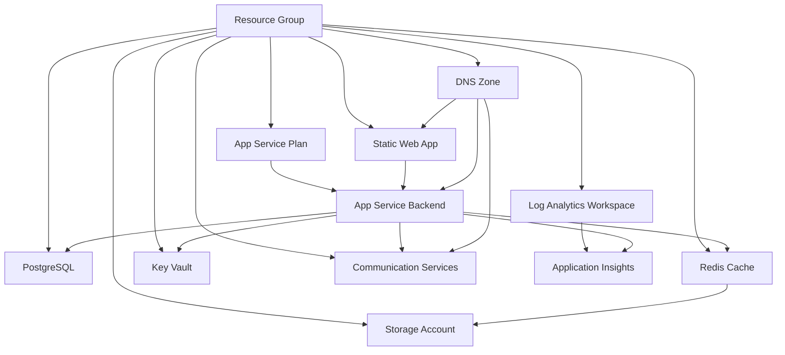

# Data Model: Azure Infrastructure Resources

**Feature**: Cloud Infrastructure & Deployment
**Date**: 2025-10-27
**Phase**: 1 - Design & Contracts

## Overview

This document defines the Azure resources required for the Fundrbolt Platform infrastructure, their relationships, configuration specifications, and dependencies. Unlike application data models, this represents infrastructure-as-code entity specifications.

## Resource Hierarchy

```text
Azure Subscription
└── Resource Groups (per environment)
    ├── App Service Plan
    │   └── App Service (Backend)
    ├── Static Web App (Frontend)
    ├── PostgreSQL Flexible Server
    ├── Azure Cache for Redis
    ├── Key Vault
    ├── Azure Communication Services
    ├── Application Insights
    │   └── Log Analytics Workspace
    ├── DNS Zone
    └── Storage Account (backups, logs)
```

## Resource Specifications

### 1. Resource Group

**Purpose**: Logical container for all Azure resources in a specific environment

**Attributes**:
- `name`: String - `fundrbolt-{environment}-rg` (e.g., `fundrbolt-prod-rg`)
- `location`: String - Azure region (e.g., `eastus`, `westus2`)
- `tags`: Object
  - `Environment`: String - `dev`, `staging`, or `production`
  - `Project`: String - `fundrbolt-platform`
  - `Owner`: String - `operations`
  - `CostCenter`: String - For billing allocation

**Configuration**:
- Production: `eastus` (primary region)
- Staging: `eastus` (same as production for consistency)
- Dev: `eastus` (cost optimization via proximity)

**Relationships**:
- Contains: All other Azure resources
- Lifecycle: Resources deleted when resource group deleted (use with caution)

---

### 2. App Service Plan

**Purpose**: Compute resource pool for backend API hosting

**Attributes**:
- `name`: String - `fundrbolt-{environment}-asp`
- `sku`: Object
  - `tier`: String - Pricing tier
  - `name`: String - SKU size code
  - `capacity`: Integer - Number of instances
- `reserved`: Boolean - `true` for Linux
- `kind`: String - `linux`
- `properties`: Object
  - `perSiteScaling`: Boolean - `false` (shared plan)
  - `maximumElasticWorkerCount`: Integer - Max autoscale instances

**Configuration by Environment**:

| Environment | Tier | SKU | Capacity | Monthly Cost |
|-------------|------|-----|----------|--------------|
| Production | Standard | S1 | 2 (autoscale 2-5) | $70 base + $35/instance |
| Staging | Standard | S1 | 1 | $70 |
| Dev | Basic | B1 | 1 | $13 |

**Autoscaling Rules** (Production only):
- Scale out: CPU > 70% for 5 minutes → add 1 instance
- Scale in: CPU < 30% for 10 minutes → remove 1 instance
- Min instances: 2 (high availability)
- Max instances: 5 (cost control)

**Relationships**:
- Contains: App Service (Backend)
- Depends on: Resource Group

---

### 3. App Service (Backend)

**Purpose**: Hosts FastAPI backend application in Docker container

**Attributes**:
- `name`: String - `fundrbolt-{environment}-api`
- `serverFarmId`: String - Reference to App Service Plan
- `kind`: String - `app,linux,container`
- `properties`: Object
  - `siteConfig`: Object
    - `linuxFxVersion`: String - `DOCKER|ghcr.io/jeanesdev/fundrbolt-backend:latest`
    - `alwaysOn`: Boolean - `true` for production/staging
    - `healthCheckPath`: String - `/health`
    - `http20Enabled`: Boolean - `true`
    - `minTlsVersion`: String - `1.2`
  - `httpsOnly`: Boolean - `true`
  - `clientAffinityEnabled`: Boolean - `false` (stateless API)

**Application Settings** (environment variables):
- `DATABASE_URL`: String - Key Vault reference
- `REDIS_URL`: String - Key Vault reference
- `JWT_SECRET`: String - Key Vault reference
- `ENVIRONMENT`: String - `dev`, `staging`, or `production`
- `LOG_LEVEL`: String - `DEBUG` (dev), `INFO` (staging/prod)
- `APPLICATIONINSIGHTS_CONNECTION_STRING`: String - From Application Insights

**Deployment Slots** (Production only):
- `production`: Primary slot receiving live traffic
- `staging`: Blue-green deployment slot for zero-downtime deploys

**Managed Identity**:
- Type: System-assigned
- Purpose: Access Key Vault secrets without credentials

**Custom Domain**:
- Production: `api.fundrbolt.com`
- Staging: `api-staging.fundrbolt.com`
- Dev: Use default `*.azurewebsites.net`

**Relationships**:
- Runs in: App Service Plan
- Connects to: PostgreSQL, Redis, Key Vault, Application Insights
- Deployed by: GitHub Actions workflow

---

### 4. Static Web App (Frontend)

**Purpose**: Hosts React PWA frontend with global CDN

**Attributes**:
- `name`: String - `fundrbolt-{environment}-admin`
- `sku`: Object
  - `tier`: String - `Standard` (production), `Free` (dev/staging)
  - `name`: String - Derived from tier
- `properties`: Object
  - `repositoryUrl`: String - GitHub repository URL
  - `branch`: String - `main`
  - `buildProperties`: Object
    - `appLocation`: String - `/frontend/fundrbolt-admin`
    - `apiLocation`: String - (empty - API hosted separately)
    - `outputLocation`: String - `dist`

**Static Web App Configuration** (`staticwebapp.config.json`):
- Routes: SPA fallback routing to `/index.html`
- Headers: Security headers (CSP, X-Frame-Options, etc.)
- CORS: Allow API domain only

**Custom Domain**:
- Production: `admin.fundrbolt.com`
- Staging: `admin-staging.fundrbolt.com`
- Dev: Use default `*.azurestaticapps.net`

**CDN Configuration**:
- Cache-Control: `public, max-age=31536000, immutable` for versioned assets
- Cache-Control: `no-cache` for `index.html`

**Relationships**:
- Connects to: App Service (Backend API)
- Deployed by: GitHub Actions workflow

---

### 5. PostgreSQL Flexible Server

**Purpose**: Managed relational database for application data

**Attributes**:
- `name`: String - `fundrbolt-{environment}-postgres`
- `version`: String - `15` (PostgreSQL version)
- `sku`: Object
  - `tier`: String - SKU tier
  - `name`: String - SKU size
- `storage`: Object
  - `storageSizeGB`: Integer - Storage capacity
  - `autoGrow`: Boolean - `true`
- `highAvailability`: Object (production only)
  - `mode`: String - `ZoneRedundant`
  - `standbyAvailabilityZone`: String - Different AZ than primary
- `backup`: Object
  - `backupRetentionDays`: Integer - Retention period
  - `geoRedundantBackup`: Boolean - `true` for production

**Configuration by Environment**:

| Environment | Tier | SKU | vCores | RAM | Storage | HA | Backup Retention | Monthly Cost |
|-------------|------|-----|--------|-----|---------|----|--------------------|--------------|
| Production | GeneralPurpose | Standard_D2s_v3 | 2 | 8GB | 128GB | Zone-Redundant | 30 days | $140 |
| Staging | GeneralPurpose | Standard_D2s_v3 | 2 | 8GB | 128GB | None | 7 days | $95 |
| Dev | Burstable | Standard_B1ms | 1 | 2GB | 32GB | None | 7 days | $12 |

**Connection Security**:
- SSL enforcement: `true`
- Minimum TLS version: `1.2`
- Firewall rules: Allow App Service subnet only
- Azure AD authentication: Enabled (admin access)

**Database Configuration**:
- `max_connections`: 100 (dev), 200 (staging/prod)
- `shared_buffers`: 25% of RAM
- `work_mem`: 16MB
- Extensions: `uuid-ossp`, `pg_trgm`, `pgcrypto`

**Relationships**:
- Accessed by: App Service (Backend)
- Backs up to: Azure Blob Storage (automatic)

---

### 6. Azure Cache for Redis

**Purpose**: In-memory cache for sessions, rate limiting, bid leaderboards

**Attributes**:
- `name`: String - `fundrbolt-{environment}-redis`
- `sku`: Object
  - `family`: String - `C` (Standard) or `P` (Premium)
  - `capacity`: Integer - Cache size
  - `name`: String - `Standard` or `Premium`
- `enableNonSslPort`: Boolean - `false` (TLS required)
- `minimumTlsVersion`: String - `1.2`
- `redisConfiguration`: Object
  - `maxmemory-policy`: String - `allkeys-lru`
  - `aof-backup-enabled`: Boolean - `true` (persistence)

**Configuration by Environment**:

| Environment | Family | SKU | Capacity | Size | Persistence | Monthly Cost |
|-------------|--------|-----|----------|------|-------------|--------------|
| Production | C | Standard | C1 | 1GB | AOF + RDB | $55 |
| Staging | C | Standard | C0 | 250MB | RDB only | $16 |
| Dev | C | Basic | C0 | 250MB | None | $16 |

**Persistence Configuration** (Production):
- AOF (Append-Only File): Enabled for write durability
- RDB snapshots: Every 1 hour
- Backup storage: Azure Blob Storage

**Firewall**:
- Allow App Service subnet only

**Relationships**:
- Accessed by: App Service (Backend)
- Backs up to: Azure Blob Storage (RDB snapshots)

---

### 7. Key Vault

**Purpose**: Centralized secrets management with audit logging

**Attributes**:
- `name`: String - `fundrbolt-{env}-kv` (max 24 chars, globally unique)
- `sku`: Object
  - `family`: String - `A`
  - `name`: String - `standard`
- `properties`: Object
  - `enableRbacAuthorization`: Boolean - `true`
  - `enableSoftDelete`: Boolean - `true`
  - `softDeleteRetentionInDays`: Integer - 90
  - `enablePurgeProtection`: Boolean - `true` (production only)
  - `enabledForDeployment`: Boolean - `false`
  - `enabledForTemplateDeployment`: Boolean - `true`

**Secrets Stored**:
- `database-url`: PostgreSQL connection string
- `redis-url`: Redis connection string
- `jwt-secret`: JWT signing key (256-bit random)
- `stripe-api-key`: Stripe API key
- `twilio-api-key`: Twilio API key
- `sendgrid-api-key`: SendGrid API key (backup email provider)

**Access Policies** (via RBAC):
- App Service Managed Identity: `Key Vault Secrets User` role
- Ops Team: `Key Vault Administrator` role (production)
- Developers: `Key Vault Secrets User` role (dev/staging only)

**Audit Logging**:
- Enable diagnostic settings
- Send logs to Log Analytics workspace
- Retain for 90 days (production: 1 year)

**Relationships**:
- Accessed by: App Service (Backend) via Managed Identity
- Logs to: Log Analytics Workspace

---

### 8. Azure Communication Services

**Purpose**: Transactional email sending with custom domain

**Attributes**:
- `name`: String - `fundrbolt-{environment}-acs`
- `dataLocation`: String - `UnitedStates`

**Email Domain Configuration**:
- Domain: `fundrbolt.com` (production), `staging.fundrbolt.com` (staging)
- Sender addresses:
  - `noreply@fundrbolt.com` - Automated notifications
  - `support@fundrbolt.com` - Customer support (forwarded)
  - `billing@fundrbolt.com` - Payment notifications

**DNS Records Required** (in Azure DNS):
- TXT: Domain ownership verification
- TXT: SPF record - `v=spf1 include:spf.azurecomm.net ~all`
- CNAME: DKIM signing key 1 (auto-generated by ACS)
- CNAME: DKIM signing key 2 (auto-generated by ACS)
- TXT: DMARC policy - `v=DMARC1; p=quarantine; rua=mailto:dmarc@fundrbolt.com`

**Sending Limits**:
- Free tier: 10,000 emails/month
- Standard tier: Pay per email ($0.0012/email)

**Relationships**:
- Accessed by: App Service (Backend)
- DNS configured in: Azure DNS Zone

---

### 9. Application Insights

**Purpose**: Application performance monitoring and logging

**Attributes**:
- `name`: String - `fundrbolt-{environment}-appinsights`
- `kind`: String - `web`
- `applicationType`: String - `web`
- `workspaceResourceId`: String - Reference to Log Analytics Workspace

**Configuration**:
- Sampling: 100% (dev/staging), 10% (production for cost optimization)
- Retention: 30 days (default), 90 days for critical telemetry
- Daily cap: 5GB/day (production), 1GB/day (staging), no cap (dev)

**Data Collection**:
- Requests: HTTP requests with duration, status, dependencies
- Dependencies: Database queries, Redis calls, external API calls
- Exceptions: Unhandled exceptions with stack traces
- Custom events: Bid placed, user registered, payment processed
- Performance counters: CPU, memory, request rate, response time

**Alert Rules**:
- Critical: Error rate >5% for 5 minutes
- Critical: P95 latency >500ms for 5 minutes
- Warning: CPU >80% for 10 minutes
- Warning: Memory >80% for 10 minutes
- Info: Deployment succeeded/failed

**Relationships**:
- Monitored apps: App Service (Backend), Static Web App (Frontend)
- Logs to: Log Analytics Workspace
- Alerts to: Action Group (email, Teams)

---

### 10. Log Analytics Workspace

**Purpose**: Centralized log storage and querying

**Attributes**:
- `name`: String - `fundrbolt-{environment}-logs`
- `sku`: Object
  - `name`: String - `PerGB2018`
- `retentionInDays`: Integer - 30 (dev/staging), 90 (production)

**Data Sources**:
- Application Insights telemetry
- App Service logs (application, HTTP, deployment)
- PostgreSQL logs (errors, slow queries)
- Redis logs
- Key Vault audit logs

**Relationships**:
- Receives logs from: All Azure resources
- Queried by: Application Insights, Azure Monitor workbooks

---

### 11. DNS Zone

**Purpose**: Domain name management for custom domains

**Attributes**:
- `name`: String - `fundrbolt.com`
- `recordSets`: Array of DNS records

**DNS Records**:

| Name | Type | TTL | Value | Purpose |
|------|------|-----|-------|---------|
| @ | A | 3600 | `<Static Web App IP>` | Root domain → frontend |
| www | CNAME | 3600 | `fundrbolt.com` | WWW redirect |
| admin | CNAME | 3600 | `<Static Web App URL>` | Admin PWA |
| api | CNAME | 3600 | `<App Service URL>` | Backend API |
| @ | TXT | 3600 | `v=spf1 include:spf.azurecomm.net ~all` | SPF record |
| _dmarc | TXT | 3600 | `v=DMARC1; p=quarantine; rua=mailto:dmarc@fundrbolt.com` | DMARC policy |
| selector1._domainkey | CNAME | 3600 | `<ACS DKIM key>` | DKIM signing key 1 |
| selector2._domainkey | CNAME | 3600 | `<ACS DKIM key>` | DKIM signing key 2 |

**SSL/TLS Certificates**:
- Auto-provisioned by Azure (App Service, Static Web Apps)
- Managed renewal (Let's Encrypt or Azure-managed)

**Relationships**:
- Points to: Static Web App (Frontend), App Service (Backend)
- Configures: Azure Communication Services email domain

---

### 12. Storage Account

**Purpose**: Backup storage for Redis snapshots and log archives

**Attributes**:
- `name`: String - `fundrbolt{environment}storage` (no hyphens, lowercase)
- `sku`: Object
  - `name`: String - `Standard_LRS` (locally redundant), `Standard_GRS` (geo-redundant for production)
- `kind`: String - `StorageV2`
- `accessTier`: String - `Cool` (for backups/archives)

**Containers**:
- `redis-backups`: RDB snapshot files
- `postgres-backups`: Manual backup exports (if needed)
- `logs-archive`: Log Analytics export (long-term retention)

**Lifecycle Management**:
- Move to Archive tier after 90 days
- Delete after 1 year (dev/staging), 7 years (production for audit compliance)

**Relationships**:
- Backup target for: Redis Cache
- Archive target for: Log Analytics

---

## Resource Dependencies Graph



## Environment-Specific Configurations

### Development

**Purpose**: Cost-optimized environment for feature development

**Key Differences**:
- Burstable database tier (1 vCore, 2GB RAM)
- Basic Redis cache (no persistence)
- Free Static Web Apps tier
- No high availability
- 7-day backup retention
- Relaxed logging (DEBUG level)

**Estimated Cost**: ~$42/month

---

### Staging

**Purpose**: Pre-production testing environment matching production configuration

**Key Differences**:
- Same SKUs as production (for accurate testing)
- Single-server database (no HA for cost savings)
- 7-day backup retention (vs 30 days in production)
- Can be shut down overnight/weekends to save costs

**Estimated Cost**: ~$240/month (when running 24/7)

---

### Production

**Purpose**: Live environment serving real users

**Key Features**:
- Zone-redundant database HA (99.99% SLA)
- Redis persistence (AOF + RDB)
- 2+ App Service instances with autoscaling
- 30-day backup retention
- Enhanced monitoring and alerting
- Manual approval gates for deployments

**Estimated Cost**: ~$289/month

---

## Security Considerations

### Network Isolation
- PostgreSQL: Firewall rules allow App Service subnet only
- Redis: Firewall rules allow App Service subnet only
- Key Vault: Private endpoint in Phase 2

### Data Encryption
- In Transit: TLS 1.2+ for all connections
- At Rest: Azure-managed encryption for all storage

### Identity & Access
- App Service: Managed identity for Key Vault access
- Developers: Azure AD authentication, RBAC for resource access
- Database: Separate admin and application credentials

### Audit & Compliance
- Key Vault: Log all secret access
- PostgreSQL: Log connection attempts and errors
- Application Insights: Track security-relevant events

---

**Data Model Completed**: 2025-10-27
**Next Phase**: Generate Bicep/Terraform templates in `contracts/` directory
